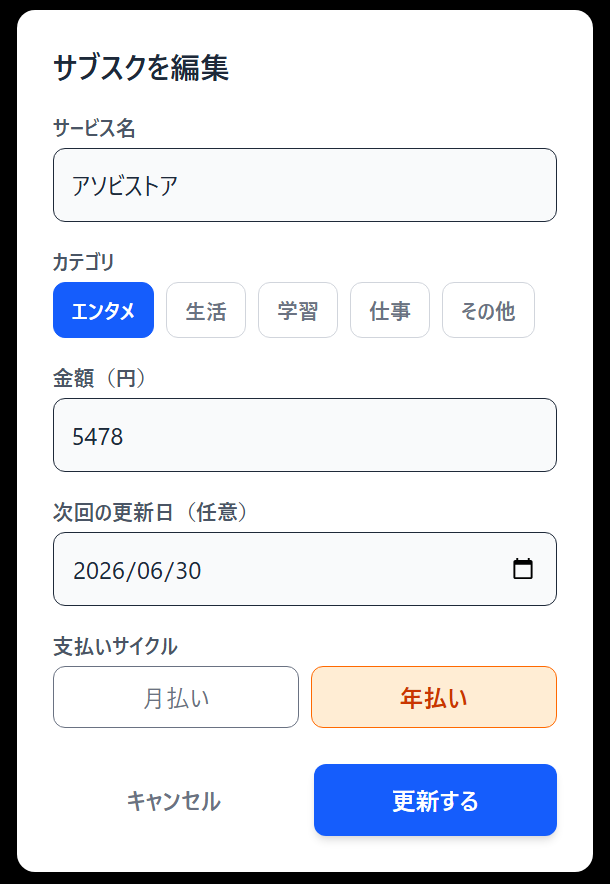
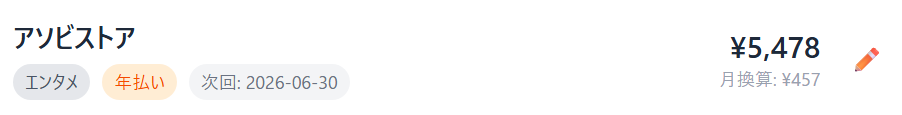
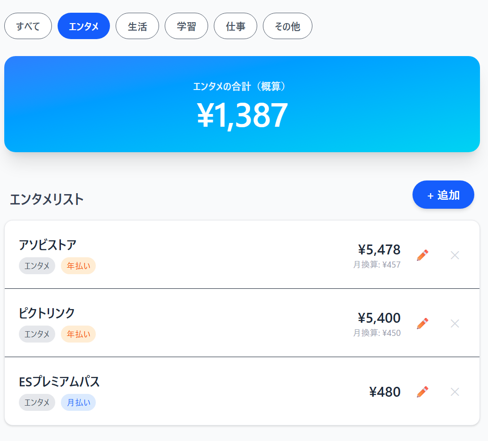
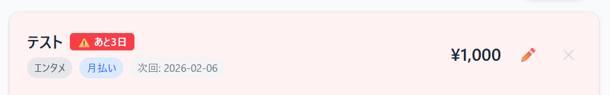

# SubscList（サブスクリスト）

動画配信サービスや、アイドルのファンクラブなどの「定額課金（サブスクリプション）」を一元管理し、毎月の固定費を可視化するWebアプリケーションです。

## 概要
「毎月、結局いくら払っているのかわからない」「解約しようと思っていたのに更新日が過ぎてしまった」といった悩みを解決するために開発しました。
年払いのサービスも月額換算して表示し、家計管理や推し活の資金管理に役立てることができます。

## 開発の背景・経緯
私自身、複数のファンクラブや動画配信サービスに入会しており、支払いの管理が煩雑になっていました。
特にファンクラブのような「年払い」のサービスと、動画サイトのような「月払い」のサービスが混在していると、実質的な月々の出費が見えにくくなります。
これらを一元管理し、支払い更新日の直前には通知でお知らせしてくれるアプリがあれば便利だと思い、開発しました。

## 公開URL
https://subsc-list-yg7n.vercel.app/

## 特徴と機能の説明

### 1. サブスクリプションのCRUD機能（登録・編集・削除）
* サービスの追加だけでなく、金額やプラン変更があった際に**後から編集する機能**を実装しました。
* 直感的なモーダルウィンドウ（ポップアップ）で操作可能です。

### 2. 高度な計算・集計ロジック
* **年払いの月割り計算**: 「年額4,000円」のサービスを登録すると、自動で「月額333円」として計算・表示します。

* **カテゴリ別集計**: 「エンタメ」「生活」「学習」などのカテゴリごとにフィルタリングができ、**選択したカテゴリだけの合計金額**を瞬時に再計算して表示します。

### 3. リマインド（更新日管理）機能
* 次回の支払い日を登録すると、**更新日の1週間前**になったアイテムを自動的にリストの一番上に並び替えます。
* 「⚠️ あと〇日」というアラートバッジを表示し、解約忘れや入金忘れを防ぎます。

### 4. セキュアな認証
* Supabase Authを使用し、ユーザーごとに独立したデータを安全に管理しています。

## 🛠 使用技術（技術スタック）

### 使用した言語やフレームワーク
* **Next.js (App Router)**: Reactベースのフレームワーク
* **TypeScript**: 型定義による安全な開発
* **Tailwind CSS**: ユーティリティファーストなスタイリング

### 開発に使用したツールやウェブサービス
* **Supabase**: データベース(PostgreSQL) / 認証(Auth)
* **Vercel**: ホスティング・デプロイ
* **GitHub / GitHub Actions**: ソースコード管理 / 定期実行処理（Ping）
* **VS Code**: 開発エディタ

## 開発期間・体制

* **開発体制**: 個人開発
* **開発期間**: 2026.01.20 〜 2026.02.03（約30時間）

## 工夫した点・苦労した点

### 工夫した点
* **UI/UXの再利用性**: 「追加」と「編集」で同じモーダルコンポーネントを使い回すロジックを組み、コードの記述量を減らしつつ機能性を高めました。
* **動的な並び替え**: 単に日付順に並べるのではなく、「期限が迫っているもの（7日以内）」を優先的に最上部に表示するアルゴリズムを実装しました。
* **カテゴリ分析**: フィルタリング切り替え時に、合計金額も連動してアニメーションするようにし、「このジャンルにいくら使っているか」が直感的にわかるようにしました。

### 苦労した点
* **Tailwind CSSのバージョン対応**: 開発中にTailwind CSS v4系の仕様変更によるエラーに直面しましたが、公式ドキュメントを参照し、PostCSSプラグインの設定を見直すことで解決しました。
* **デプロイ時の環境変数**: Vercelへのデプロイ時にSupabaseの接続キー設定が必要な点を学び、セキュリティを意識した開発を行いました。

## 既知の課題と今後の展望 

* **グラフによる可視化**: カテゴリごとの出費割合を円グラフなどで表示したい。
* **LINE通知機能**: 現在は画面上の表示のみですが、更新日が近づいたらLINEやメールで通知が届くようにしたい。
* **サブスクの検索機能**: 登録数が増えた場合に備え、キーワード検索機能を実装したい。

## 連絡先
* https://0205sone.github.io/portfolio/